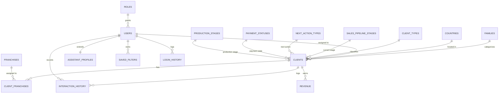

# Mafali CRM — Database Design v1

Target engine: PostgreSQL (rationale covered separately in the technology stack discussion; this design assumes standard PostgreSQL types and constraint features — `IDENTITY`, `NUMERIC`, `TIMESTAMPTZ`, partial unique indexes, `JSONB`). Every deviation from the legacy schema is called out with the reasoning and, where it traces back to a specific finding, the risk register item number.

---

## 1. Design conventions (applied consistently across all tables)

**Surrogate primary keys.** Every table gets `id BIGINT GENERATED ALWAYS AS IDENTITY PRIMARY KEY`. This directly replaces the legacy pattern of manually-generated keys (Cle_Opl's max+1 scan, and the Excel-import mechanisms that assigned IDs three different ways — Risk #1). A database-generated identity column removes the concurrency-collision risk entirely.

**Legacy key preservation.** Where a legacy manually-assigned identifier existed and might still be referenced in old reports, emails, or staff memory (Cle_Opl), it's preserved as a nullable, unique `legacy_client_number` column rather than as the primary key — traceable for migration and reconciliation, but no longer load-bearing.

**Audit columns.** Every table that represents mutable business data gets: `created_at TIMESTAMPTZ NOT NULL DEFAULT now()`, `created_by BIGINT REFERENCES users(id)`, `updated_at TIMESTAMPTZ NOT NULL DEFAULT now()`, `updated_by BIGINT REFERENCES users(id)`. The legacy system had no concept of "who created/modified this" anywhere — this is a straightforward improvement with no downside, so I'm applying it everywhere rather than treating it as a per-table decision.

**Soft delete.** Applied to every table that other tables reference by foreign key (clients, franchises, families, countries, users) via a nullable `deleted_at TIMESTAMPTZ`. This directly addresses Risk #4 (hard delete, no recovery) and also solves a real technical problem the legacy schema didn't have to deal with: once real foreign keys exist, hard-deleting a franchise or country that a client still references would either fail or silently orphan data. Soft delete sidesteps that. Deleted rows are excluded from normal queries via a view or a `WHERE deleted_at IS NULL` convention in the application's data-access layer.

**Timestamps merged.** Every place the legacy schema split a date and a time into two separate fields (Date_Saisie/Heure_Saisie, Date_Rappel/Heure_Rappel), the new schema uses a single `TIMESTAMPTZ`. Simpler, sortable, timezone-safe, and removes an entire category of the legacy code's manual date/time-string handling.

**No more sentinel dates.** The legacy convention of using 3000-01-01 to mean "no reminder set" is replaced by an actual `NULL`. This is what NULL is for; there's no reason to carry the sentinel-value pattern forward.

**Lookup tables instead of free-text status fields.** Every place the legacy app stored a value from a fixed, known list as free text in a `Chaîne` field (Status_Vente, Op_En_Cours, Statuts_Clients, EtatClient, Production) becomes a foreign key to a small reference table instead. This gives us real referential integrity on values that were previously just conventions enforced only by which combo-box options existed in the UI — and resolves the EtatClient coded-vs-text ambiguity found during review (it becomes a real FK either way, so the ambiguity disappears).

---

## 2. Entity-relationship overview

---

## 3. Core business tables

### clients (replaces France_Optique)

| Column | Type | Notes |
|---|---|---|
| id | BIGINT IDENTITY PK | |
| legacy_client_number | INTEGER UNIQUE NULL | preserves Cle_Opl for migration traceability only |
| family_id | BIGINT NULL → families.id | was free-text Famille |
| company_name | VARCHAR(120) NOT NULL | was Raison_Sociale |
| address_complement | VARCHAR(120) | |
| street | VARCHAR(120) | |
| address_line_1 | VARCHAR(120) | was Localisation_1 |
| address_line_2 | VARCHAR(120) | was Localisation_2 |
| postal_code | VARCHAR(10) | |
| city | VARCHAR(80) | |
| country_id | BIGINT NULL → countries.id | was free-text Pays |
| phone | VARCHAR(30) | |
| phone_secondary | VARCHAR(30) | was TelBis |
| mobile | VARCHAR(30) | was Portable |
| fax | VARCHAR(30) | |
| email | VARCHAR(120) | validated at the application layer with the same pattern the legacy app used |
| assigned_user_id | BIGINT NULL → users.id | was Assistante_Commerciale (free text); see §5 — resolved to point at a real user |
| purchasing_contact | VARCHAR(100) | was Responsable_Achat |
| sales_rep | VARCHAR(120) | was Représentant |
| client_type_id | BIGINT NOT NULL → client_types.id | was EtatClient |
| sales_stage_id | BIGINT NULL → sales_pipeline_stages.id | was Status_Vente |
| next_action_type_id | BIGINT NULL → next_action_types.id | was Op_En_Cours |
| payment_status_id | BIGINT NULL → payment_statuses.id | was Statuts_Clients |
| production_stage_id | BIGINT NULL → production_stages.id | was Production |
| store | VARCHAR(80) | was Magasin_Principal — **left as free text; no reference table for it was found in the legacy app despite behaving like a category. Open question for you: is there a fixed list of stores/"magasins" that should be normalized like the others?** |
| next_reminder_at | TIMESTAMPTZ NULL | was Date_Rappel+Heure_Rappel; NULL = no reminder, replacing the sentinel-date convention |
| short_note | VARCHAR(250) | was Note |
| permanent_note | TEXT | was NotePerm |
| is_blocked | BOOLEAN NOT NULL DEFAULT false | was bloque |
| created_at / created_by / updated_at / updated_by | see §1 | replaces Date_Saisie/Heure_Saisie, which was really just "last touched," not a true creation timestamp |
| deleted_at | TIMESTAMPTZ NULL | see §1 |

**Dropped from legacy, deliberately:** the standalone `RappelRDV` boolean. Its only consumer (the daily reminder query) can be expressed as `next_reminder_at IS NOT NULL AND next_reminder_at::date = today`, making a separate flag redundant — **pending your confirmation that RappelRDV isn't independently meaningful somewhere I didn't find** (Risk #26). If it turns out to matter, it's a trivial column to add back.

**Indexes:** `assigned_user_id`, `next_reminder_at` (for the daily reminder query), `company_name` (trigram/GIN index if fuzzy search on name is wanted — the legacy multi-criteria search implies staff do search by partial name), `country_id`, `family_id`, and the lookup FKs.

### client_franchises (new — replaces Franchise/Franchise2/Franchise3/Franchise4)

| Column | Type | Notes |
|---|---|---|
| client_id | BIGINT → clients.id | |
| franchise_id | BIGINT → franchises.id | |

Composite primary key `(client_id, franchise_id)`. This replaces the legacy's four fixed franchise slots on the client row with a proper many-to-many relationship — confirmed during review to be a genuine multi-value business need (Domain Model v2), not a legacy artifact, so this isn't a stylistic preference; it's fixing an actual limitation (the old design hard-capped a client at exactly 4 franchises with no constraint preventing duplicates across the four slots).

### interaction_history (replaces Historique)

| Column | Type | Notes |
|---|---|---|
| id | BIGINT IDENTITY PK | was Id_Histo |
| client_id | BIGINT NOT NULL → clients.id | was Num_Client — now a real enforced FK, which also eliminates the signed/unsigned type mismatch found during review (Risk #2) |
| assistant_user_id | BIGINT NULL → users.id | was Assistante_Commerciale (free text) |
| occurred_at | TIMESTAMPTZ NOT NULL DEFAULT now() | merges Date_Saisie+Heure_Saisie |
| next_reminder_at | TIMESTAMPTZ NULL | merges Date_Rappel+Heure_Rappel, captured at the time of this interaction |
| action_type_id | BIGINT NULL → next_action_types.id | structured, best-effort |
| action_description | TEXT | **see note below** |
| sales_stage_id | BIGINT NULL → sales_pipeline_stages.id | was Status_Vente, only meaningfully set when action_type = "Vente en Cours" |
| note | TEXT | was Note |
| attachment_storage_key | VARCHAR(255) NULL | replaces FicStk binary-in-DB; see §6 |
| attachment_filename | VARCHAR(255) NULL | |
| company_name_snapshot | VARCHAR(120) | point-in-time copy, see note below |
| city_snapshot | VARCHAR(80) | |
| postal_code_snapshot | VARCHAR(10) | |
| payment_status_snapshot | VARCHAR(50) | stored as text here, not FK — a snapshot should reflect the label as it was, even if the lookup table's row is later renamed |
| store_snapshot | VARCHAR(80) | |
| franchise_names_snapshot | TEXT | comma-joined, same reasoning as above |
| created_at / created_by | see §1 | |

**Why `action_description` is free text instead of purely an enum FK:** the legacy Opération field doesn't cleanly map to the operation enum — it sometimes holds a composed narrative string (e.g. "Non intéressé le 12/03/2026, à recontacter le : ") rather than just the raw enum value. Rather than force a lossy conversion, the new design captures both: a structured `action_type_id` for filtering/reporting, and the original narrative in `action_description` for fidelity. This is a case where faithful behavior and clean structure aren't the same thing, and I chose to keep both rather than pick one.

**Why the snapshot fields are preserved as discrete columns rather than dropped or moved to JSONB:** confirmed during review that this denormalization is intentional — each interaction should show what was true about the client *at that moment*, even if the client's current data has since changed. Discrete columns (vs. a JSONB blob) keep this table easy to query and report on directly, which matters for what is functionally an audit/history feature.

**Deliberately no `deleted_at` or edit columns on this table.** This is the one place I'm recommending a real behavior change from the legacy system rather than faithful replication: Historique was fully editable and hard-deletable through an admin screen with no validation (Risk #13), which undermines its value as a record of what actually happened. My recommendation is to make this table insert-only at the database level (revoke UPDATE/DELETE grants from the application role; only a migration/admin process can touch it directly) and handle corrections by inserting a new row that references the one it corrects via a nullable `supersedes_id BIGINT REFERENCES interaction_history(id)`. **This is a deliberate architecture decision, not an assumption — flagging it clearly so you can override it if the business actually depends on being able to edit history entries.**

**Indexes:** `client_id`, `occurred_at`, `assistant_user_id`.

### revenue (replaces CA)

| Column | Type | Notes |
|---|---|---|
| id | BIGINT IDENTITY PK | was IDCA |
| client_id | BIGINT NOT NULL → clients.id | |
| year | SMALLINT NOT NULL CHECK (year BETWEEN 1990 AND 2100) | was a 4-character string with app-level validation; now a real typed, constrained column |
| amount | NUMERIC(12,2) NOT NULL | was a plain 4-byte integer — **upgraded to decimal pending your confirmation on whether sub-unit precision is actually needed; safe default since downgrading later is easy and losing precision from an integer wouldn't have been recoverable** |
| currency | CHAR(3) NOT NULL DEFAULT 'EUR' | not present in the legacy schema; low-cost addition given this is a French business, worth having if multi-currency ever becomes relevant |
| created_at / created_by / updated_at / updated_by | see §1 | |

`UNIQUE (client_id, year)` — **now actually enforced at the database level.** The legacy schema left this as a non-unique index and relied entirely on application code to block duplicates (Risk #6, confirmed the app-level check works correctly, but this closes the gap for any path that bypasses the UI, like a future import job).

---

## 4. Reference / lookup tables

All follow the same shape: `id BIGINT IDENTITY PK`, `code VARCHAR(50) UNIQUE NOT NULL`, `label VARCHAR(100) NOT NULL`, `sort_order SMALLINT`, `is_active BOOLEAN NOT NULL DEFAULT true`, `deleted_at TIMESTAMPTZ NULL`.

| Table | Replaces | Seed values |
|---|---|---|
| client_types | EtatClient | Client, Prospect |
| sales_pipeline_stages | Status_Vente | Devis en cours, Vente (BAT Signé), Vente (BAT Original), Vente (Bon de Commande), Vente Annulée, Production |
| next_action_types | Op_En_Cours | A Rappeler Mois, A Rappeler Date, A Rappeler Date Heure, Pas Intéressé, Vente en Cours, Production |
| payment_statuses | Statuts_Clients | Impayés, Payés, Bloqués |
| production_stages | Production | En test, Test couleur valide date, A imprimer, Imprimé, Calandré, Conditionné, Facture, Livré |
| families | Type_Famille | migrated from existing data |
| franchises | Type_Franchise | migrated from existing data |
| countries | Pays | migrated from existing data, plus adding a real `iso_code CHAR(2)` column so the new system can lean on a standard library (e.g. libphonenumber) instead of a bespoke masque field — `phone_mask` and `dialing_code` are kept for continuity during migration but the long-term plan should be a standard phone-number library |

Using `is_active` rather than deleting rows outright for these lets you retire an option (say, an old production stage) without breaking historical records that still reference it — same reasoning as the snapshot columns above.

---

## 5. Auth & access tables

These replace the GPW/WDGPU component entirely, per the Module 9 recommendation (replace, don't port).

### users (replaces GPWUtilisateur)

| Column | Type | Notes |
|---|---|---|
| id | BIGINT IDENTITY PK | |
| email | VARCHAR(120) UNIQUE NOT NULL | login identifier |
| password_hash | VARCHAR(255) NOT NULL | bcrypt/argon2 — **replacing the legacy plaintext storage; this is non-negotiable, see Risk #21** |
| first_name / last_name | VARCHAR(80) | |
| role_id | BIGINT NOT NULL → roles.id | |
| must_change_password | BOOLEAN NOT NULL DEFAULT true | keeps the legacy "set your own password on first login" UX, now backed by real hashing |
| is_active | BOOLEAN NOT NULL DEFAULT true | |
| last_login_at | TIMESTAMPTZ NULL | |
| created_at / created_by / updated_at / updated_by / deleted_at | see §1 | |

**Not carrying forward:** the legacy `Application` dimension (GPW was built to manage users across multiple different applications sharing one user pool). The new system is Mafali-specific; there's no reason to model multi-application user management unless you specifically want to reuse this system elsewhere — worth a direct question if that's actually a goal, otherwise it's scope not worth carrying.

### roles (simplified replacement for GPWConfiguration)

| Column | Type | Notes |
|---|---|---|
| id | BIGINT IDENTITY PK | |
| name | VARCHAR(80) UNIQUE NOT NULL | e.g. "Supervisor", "Assistant" |
| permissions | JSONB NOT NULL DEFAULT '[]' | a list of named permission strings (screen/feature-level, e.g. `"clients.delete"`, `"filters.view_all"`) |

**This is the one place in this design where I'm proposing something materially simpler than the legacy system, and flagging it explicitly rather than just doing it.** The legacy permission engine (GPWDetailConfiguration) supports per-window, per-individual-UI-element toggles — visibility/enabled state for every button, field, menu item, etc., per role. Replicating that literally would mean building a live UI-reflection permission engine, which is a large, ongoing engineering cost for a capability I found no evidence is actually used in practice (Risk #23 — still open). This design defaults to conventional feature/screen-level RBAC. **If you confirm the business genuinely relies on restricting individual fields/buttons per role today, this table needs to change to something closer to the legacy model, and I'd want to know that before implementation starts, not after.**

### assistant_profiles (replaces Assistantes)

| Column | Type | Notes |
|---|---|---|
| user_id | BIGINT PK → users.id | 1:1 extension, not a separate identity — resolves the Assistantes/GPWUtilisateur duality found during review |
| department | VARCHAR(80) | was Service |
| can_view_all_filters | BOOLEAN NOT NULL DEFAULT false | was All_Filtres |
| comment | VARCHAR(250) | |
| deleted_at | TIMESTAMPTZ NULL | |

### login_history (replaces GPWHistoriqueConnexion)

| Column | Type | Notes |
|---|---|---|
| id | BIGINT IDENTITY PK | |
| user_id | BIGINT NOT NULL → users.id | |
| logged_in_at | TIMESTAMPTZ NOT NULL DEFAULT now() | |
| success | BOOLEAN NOT NULL | |
| ip_address | INET NULL | not present in legacy; low-cost, standard addition |

**No "wipe history" capability at the application layer** — the legacy screen let a supervisor erase this entire table with one confirmation (Risk #24). Recommended replacement: an automatic retention policy (e.g., a scheduled job that purges rows older than N months) rather than a manual delete-everything button, if old login records need to be pruned at all.

---

## 6. Filters (consolidated)

### saved_filters (replaces both Filtre_Opératrice and Filtre_Historique)

| Column | Type | Notes |
|---|---|---|
| id | BIGINT IDENTITY PK | |
| entity_type | VARCHAR(20) NOT NULL CHECK (entity_type IN ('client','history')) | |
| owner_user_id | BIGINT NULL → users.id | NULL = shared/global filter |
| name | VARCHAR(100) NOT NULL | |
| conditions | JSONB NOT NULL | structured array of `{field, operator, value, value2}` objects |
| created_at / created_by / updated_at / updated_by / deleted_at | see §1 | |

**Consolidating two legacy tables into one.** Filtre_Opératrice (per-operator client filters) and Filtre_Historique (shared history filters) were structurally identical except for the operator-ownership column — this was flagged during review as functionally duplicated design. One table with a nullable owner column covers both cases cleanly.

**Structured JSONB conditions instead of a raw filter-string.** The legacy `Filtre_Réel` field stored a hand-assembled, capped-at-512-characters string in a small query DSL — functional, but fragile, and awkward to validate or migrate. Since the UI that builds these was already structured (pick a field, pick a condition type, enter one or two values), storing that structure directly instead of a flattened string is a straightforward improvement with no loss of capability.

**Uniqueness.** A personal filter name must be unique per owner; a global filter name must be unique among global filters. In Postgres this needs two constraints, since a plain composite unique constraint treats every `NULL` owner as distinct from every other: a normal `UNIQUE (entity_type, owner_user_id, name)` for owned filters, plus a partial unique index `CREATE UNIQUE INDEX ON saved_filters (entity_type, name) WHERE owner_user_id IS NULL` for global ones.

---

## 7. Open items affecting this design

These don't block moving forward — the design above reflects my best-justified default for each — but your answers could change specific columns:

1. **RappelRDV flag** (clients table) — kept as computed logic (`next_reminder_at IS NOT NULL`) rather than a stored column. Reversible if it turns out to carry independent meaning.
2. **Revenue precision** — defaulted to `NUMERIC(12,2)`. Confirm if whole-currency-unit (matching the legacy integer) is actually sufficient.
3. **Store/"Magasin" field** — left as free text; confirm if there's a fixed list that should become a lookup table like the others.
4. **Permission granularity** — `roles.permissions` defaults to simple feature-level RBAC. Confirm whether individual field/button-level restriction is genuinely needed anywhere today.
5. **Historique immutability** — designed as insert-only with a `supersedes_id` correction pattern. Confirm this doesn't conflict with how staff actually use the "edit history" admin screen today.
6. **BLOB storage** — `interaction_history.attachment_storage_key` assumes object storage (S3-compatible) rather than storing files in the database. Reasonable default, but worth confirming expected attachment volume/size before committing.

---

## 8. What's next

With the schema in place, the next steps per the original plan are architecture and technology stack (informed by this design — nothing here requires anything beyond a standard relational database and a conventional web backend) and then project estimation. I'd suggest tackling the tech stack next, since the three questions I raised earlier (team skillset, hosting constraints, budget/support expectations) are the last real inputs needed before that's a confident, specific recommendation rather than a generic one.
